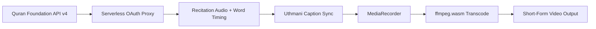

 

---

### Currently
**Building** `quran-shorts-generator` · **Studying** CS & AI at Matrouh University · **Exploring** on-device + agentic AI pipelines

## About

| About | Mindset |
| --- | --- |
| I build full-stack, native Android, and AI systems end-to-end — from normalized database schemas and REST APIs to on-device computer vision and mobile UIs. Currently a CS & AI student at Matrouh University, working toward my next role as an Android/AI developer. | I diagnose a problem precisely before pointing AI at it — never vibe-coding. I'd rather ship an offline-first, zero-budget system that survives Doze and reboots than a fragile one that only works in a demo. |

## Stack

**Languages**

**Mobile & Frontend**

**AI / ML**

**Backend & Data**

**Tools**

## Engineering Principles

| 01 | Diagnose the problem precisely before pointing AI at it — never vibe-code a fix. |
| --- | --- |
| 02 | Offline-first beats "assume there's a connection." |
| 03 | Clean architecture over quick hacks — MVVM, normalized schemas, no shortcuts. |
| 04 | A feature isn't done until it survives Doze, reboots, and missing permissions. |
| 05 | Smart architecture beats a big budget — build production systems for free. |

## Learning Roadmap

| Stage | Focus |
| --- | --- |
| Foundation | Python, Java, OOP, Data Structures & Algorithms |
| Depth | Kotlin, Jetpack Compose, MVVM + StateFlow, Android internals |
| AI | TensorFlow, Keras, MediaPipe, Computer Vision, LLM tooling |
| **Now** | Zero-budget AI media pipelines (serverless + on-device hybrid) |
| Next | Agentic AI systems and native Android ML on `MediaCodec` |

## Featured Project

### `quran-shorts-generator`

A zero-budget web app that generates short-form videos combining Quranic recitation audio, word-synchronized Uthmani-script captions, and nature imagery — with a native Android/Kotlin phase in progress.

   

**Why this is hard:** syncing word-level Uthmani captions to recitation audio, keeping OAuth and CORS handling inside two free-tier serverless functions, and transcoding entirely in-browser — all on a zero-budget stack with no dedicated backend server.

## Other Projects

| Project | Stack | What it does |
| --- | --- | --- |
| **ProjectEngine v2.0** | Kotlin · PHP 8 · MySQL | Full-stack hiring platform — 22-endpoint REST API + native Android app on one shared backend |
| **EyeCare AI** | Kotlin · Flutter · MediaPipe · Gemini | On-device eye health risk detection, cross-validated by a Large Vision Model |
| **Flowify** | Flutter · AI Logic Engine | Converts natural language / code into interactive flowcharts with a custom layout engine |
| **Mesk** | Kotlin · Jetpack Compose · Room | Offline-first Islamic utility app — prayer times, Qibla, Athkar, Doze-proof scheduling |
| **ProtocolChat** | Kotlin · Flutter · BT/Wi-Fi P2P | Offline peer-to-peer encrypted messaging, no internet required |

## Metrics

### Let's talk systems.

